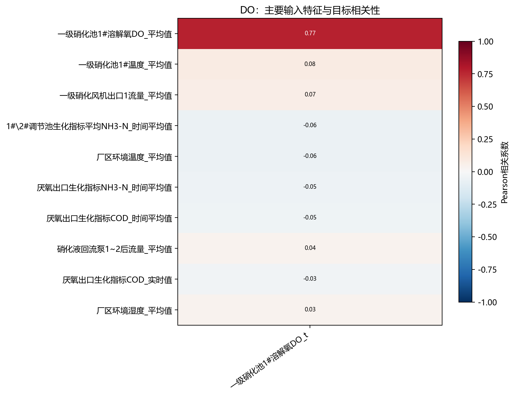
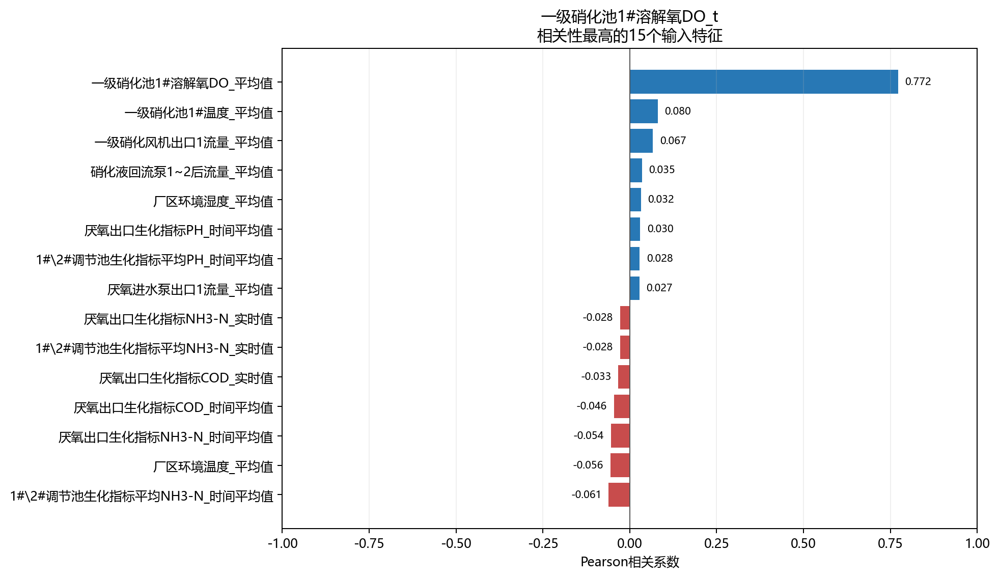

# DO相关性分析

- 样本数：25,919
- 输入特征数：48
- 目标数：1
- 方法：Pearson衡量线性关系，Spearman衡量单调关系。

## 目标：一级硝化池1#溶解氧DO_t

目标均值为6.994，标准差为0.2039，范围为0～7，不同取值数为2。

相关性最高的5个输入特征：

- `一级硝化池1#溶解氧DO_平均值`：Pearson=0.772，呈强正相关；Spearman=0.727。
- `一级硝化池1#温度_平均值`：Pearson=0.080，呈很弱正相关；Spearman=0.028。
- `一级硝化风机出口1流量_平均值`：Pearson=0.067，呈很弱正相关；Spearman=0.028。
- `1#\2#调节池生化指标平均NH3-N_时间平均值`：Pearson=-0.061，呈很弱负相关；Spearman=-0.022。
- `厂区环境温度_平均值`：Pearson=-0.056，呈很弱负相关；Spearman=-0.047。
- 注意：该目标变化极少，相关系数稳定性不足，不宜据此判断变量重要性。

## 输入特征共线性

- `1#\2#调节池生化指标平均NH3-N_实时值` 与 `厌氧出口生化指标NH3-N_实时值`：r=1.000。
- `一级硝化池1#温度_变化率` 与 `一级硝化池1#溶解氧DO_变化值`：r=1.000。
- `一级硝化池1#温度_变化值` 与 `一级硝化池1#温度_变化率`：r=0.999。
- `一级硝化池1#温度_变化值` 与 `一级硝化池1#溶解氧DO_变化值`：r=0.999。
- `1#\2#调节池生化指标平均NH3-N_时间平均值` 与 `厌氧出口生化指标NH3-N_时间平均值`：r=0.984。
- `厂区环境温度_变化值` 与 `厂区环境温度_变化率`：r=0.949。
- `厂区环境湿度_变化值` 与 `厂区环境湿度_变化率`：r=0.933。
- `1#\2#调节池生化指标平均PH_时间平均值` 与 `厌氧出口生化指标PH_时间平均值`：r=0.929。

## 解读说明

- 相关性不代表因果关系，也不能替代模型特征重要性或消融实验。
- 水质化验值按日复制至分钟级，因此同日内不发生变化，相关性主要反映跨日趋势。
- HRT平均值和对应实时值可能高度相关，建模时应结合共线性结果进行筛选或正则化。