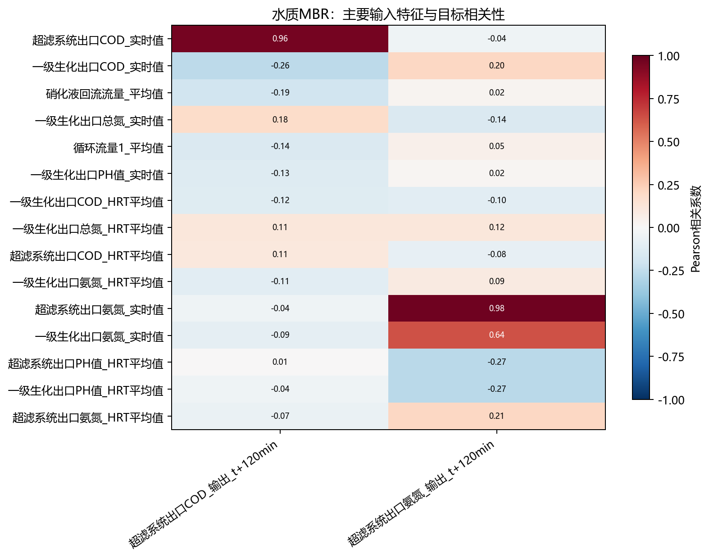
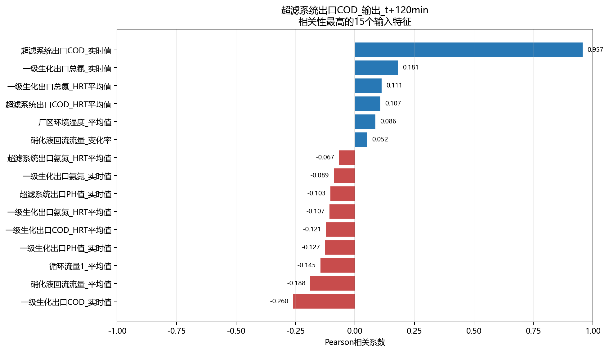
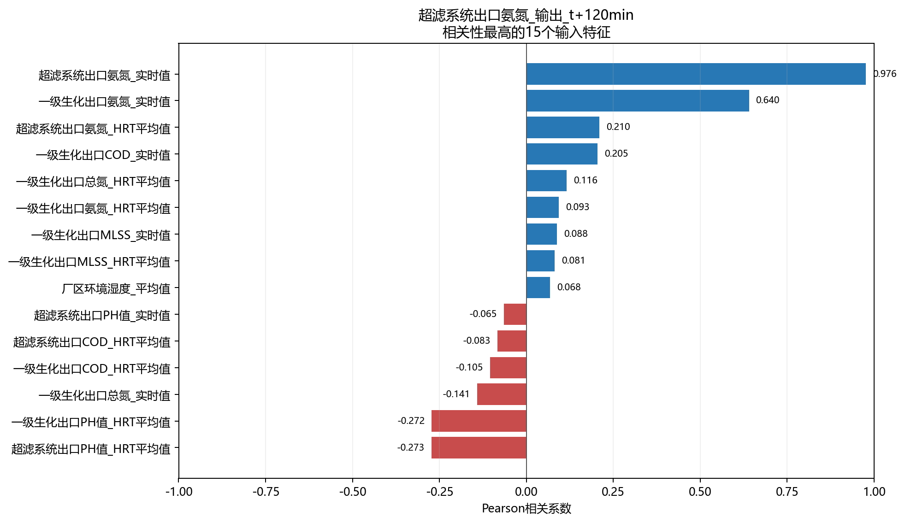

# 水质MBR相关性分析

- 样本数：1,103
- 输入特征数：30
- 目标数：2
- 方法：Pearson衡量线性关系，Spearman衡量单调关系。

## 目标：超滤系统出口COD_输出_t+120min

目标均值为512.7，标准差为85.53，范围为500～1126，不同取值数为3。

相关性最高的5个输入特征：

- `超滤系统出口COD_实时值`：Pearson=0.957，呈强正相关；Spearman=0.957。
- `一级生化出口COD_实时值`：Pearson=-0.260，呈弱负相关；Spearman=-0.235。
- `硝化液回流流量_平均值`：Pearson=-0.188，呈很弱负相关；Spearman=-0.145。
- `一级生化出口总氮_实时值`：Pearson=0.181，呈很弱正相关；Spearman=0.182。
- `循环流量1_平均值`：Pearson=-0.145，呈很弱负相关；Spearman=-0.130。
- 注意：该目标变化极少，相关系数稳定性不足，不宜据此判断变量重要性。

## 目标：超滤系统出口氨氮_输出_t+120min

目标均值为12.19，标准差为8.249，范围为10～50，不同取值数为12。

相关性最高的5个输入特征：

- `超滤系统出口氨氮_实时值`：Pearson=0.976，呈强正相关；Spearman=0.958。
- `一级生化出口氨氮_实时值`：Pearson=0.640，呈中等正相关；Spearman=0.407。
- `超滤系统出口PH值_HRT平均值`：Pearson=-0.273，呈弱负相关；Spearman=-0.380。
- `一级生化出口PH值_HRT平均值`：Pearson=-0.272，呈弱负相关；Spearman=-0.330。
- `超滤系统出口氨氮_HRT平均值`：Pearson=0.210，呈弱正相关；Spearman=0.424。

## 输入特征共线性

- `一级生化出口COD_HRT平均值` 与 `一级生化出口总氮_HRT平均值`：r=-0.963。
- `厂区环境温度_变化值` 与 `厂区环境温度_变化率`：r=0.944。
- `厂区环境湿度_变化值` 与 `厂区环境湿度_变化率`：r=0.940。
- `厂区环境温度_变化值` 与 `厂区环境湿度_变化率`：r=-0.923。
- `一级生化出口PH值_HRT平均值` 与 `超滤系统出口PH值_HRT平均值`：r=0.909。
- `一级生化出口COD_HRT平均值` 与 `一级生化出口总氮_实时值`：r=-0.891。
- `一级生化出口总氮_实时值` 与 `一级生化出口总氮_HRT平均值`：r=0.878。
- `一级生化出口PH值_实时值` 与 `超滤系统出口PH值_实时值`：r=0.863。

## 解读说明

- 相关性不代表因果关系，也不能替代模型特征重要性或消融实验。
- 水质化验值按日复制至分钟级，因此同日内不发生变化，相关性主要反映跨日趋势。
- HRT平均值和对应实时值可能高度相关，建模时应结合共线性结果进行筛选或正则化。