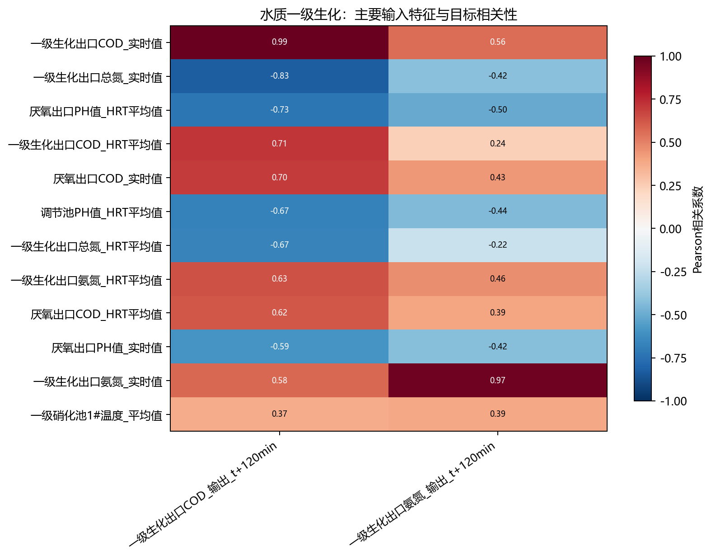
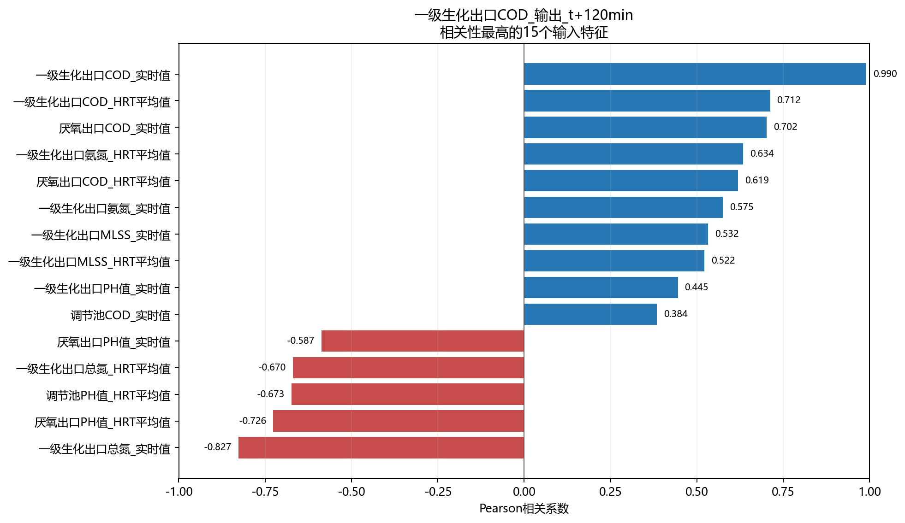
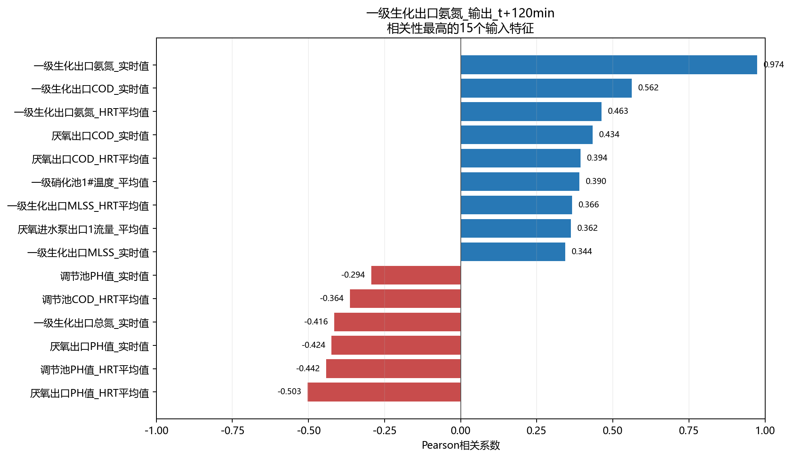

# 水质一级生化相关性分析

- 样本数：1,103
- 输入特征数：45
- 目标数：2
- 方法：Pearson衡量线性关系，Spearman衡量单调关系。

## 目标：一级生化出口COD_输出_t+120min

目标均值为671.2，标准差为82.43，范围为500～835.8，不同取值数为73。

相关性最高的5个输入特征：

- `一级生化出口COD_实时值`：Pearson=0.990，呈强正相关；Spearman=0.990。
- `一级生化出口总氮_实时值`：Pearson=-0.827，呈强负相关；Spearman=-0.831。
- `厌氧出口PH值_HRT平均值`：Pearson=-0.726，呈强负相关；Spearman=-0.687。
- `一级生化出口COD_HRT平均值`：Pearson=0.712，呈强正相关；Spearman=0.711。
- `厌氧出口COD_实时值`：Pearson=0.702，呈强正相关；Spearman=0.710。

## 目标：一级生化出口氨氮_输出_t+120min

目标均值为16.69，标准差为11.14，范围为10～50，不同取值数为54。

相关性最高的5个输入特征：

- `一级生化出口氨氮_实时值`：Pearson=0.974，呈强正相关；Spearman=0.981。
- `一级生化出口COD_实时值`：Pearson=0.562，呈中等正相关；Spearman=0.683。
- `厌氧出口PH值_HRT平均值`：Pearson=-0.503，呈中等负相关；Spearman=-0.755。
- `一级生化出口氨氮_HRT平均值`：Pearson=0.463，呈中等正相关；Spearman=0.715。
- `调节池PH值_HRT平均值`：Pearson=-0.442，呈中等负相关；Spearman=-0.743。

## 输入特征共线性

- `调节池氨氮_HRT平均值` 与 `厌氧出口氨氮_HRT平均值`：r=1.000。
- `调节池氨氮_实时值` 与 `厌氧出口氨氮_实时值`：r=1.000。
- `一级硝化池1#溶解氧DO_变化值` 与 `一级硝化池1#溶解氧DO_变化率`：r=1.000。
- `一级硝化池1#温度_变化值` 与 `一级硝化池1#温度_变化率`：r=0.999。
- `一级硝化池1#温度_变化值` 与 `一级硝化池1#溶解氧DO_变化值`：r=0.968。
- `一级硝化池1#温度_变化值` 与 `一级硝化池1#溶解氧DO_变化率`：r=0.968。
- `一级硝化池1#温度_变化率` 与 `一级硝化池1#溶解氧DO_变化率`：r=0.965。
- `一级硝化池1#温度_变化率` 与 `一级硝化池1#溶解氧DO_变化值`：r=0.965。

## 解读说明

- 相关性不代表因果关系，也不能替代模型特征重要性或消融实验。
- 水质化验值按日复制至分钟级，因此同日内不发生变化，相关性主要反映跨日趋势。
- HRT平均值和对应实时值可能高度相关，建模时应结合共线性结果进行筛选或正则化。