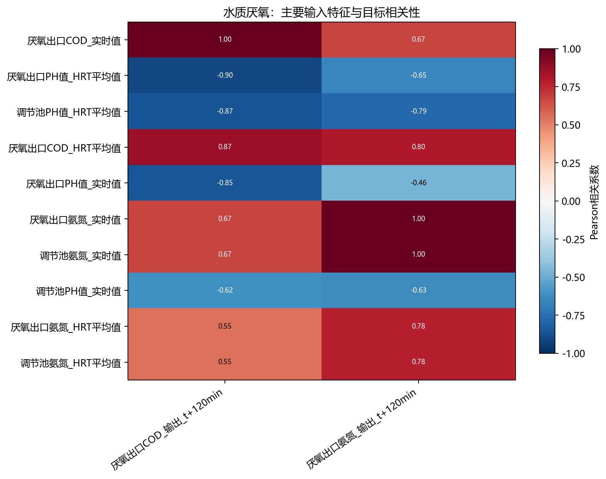
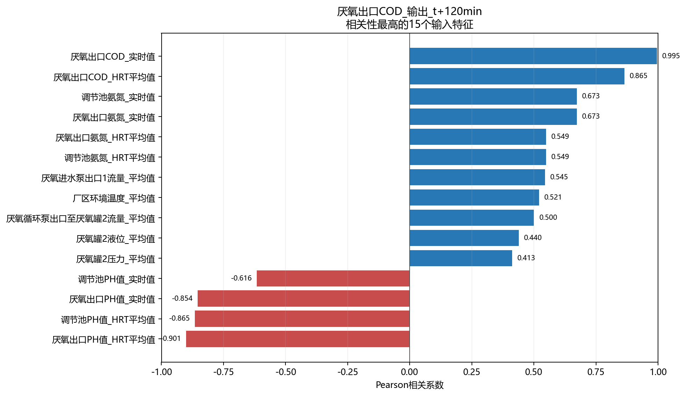
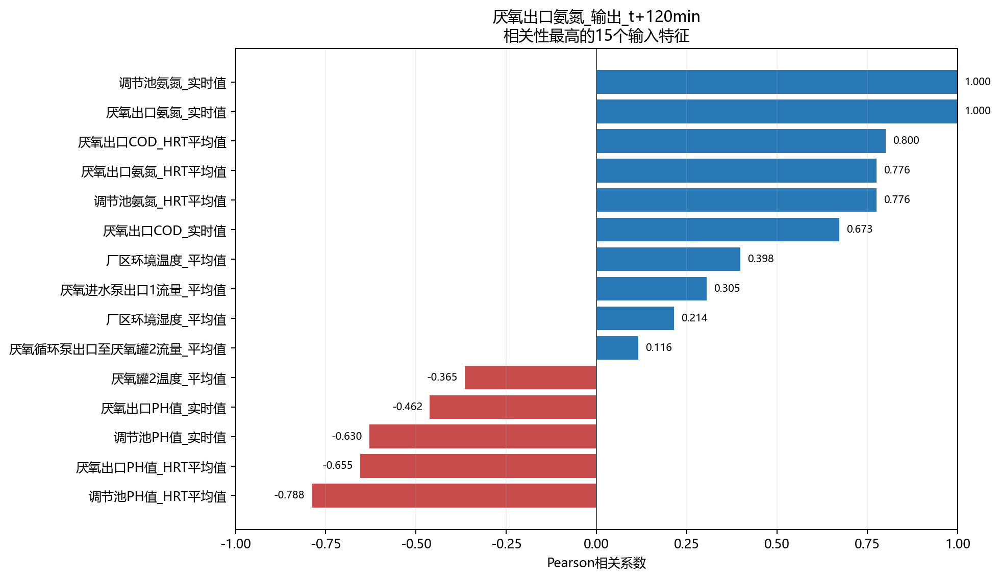

# 水质厌氧相关性分析

- 样本数：1,103
- 输入特征数：36
- 目标数：2
- 方法：Pearson衡量线性关系，Spearman衡量单调关系。

## 目标：厌氧出口COD_输出_t+120min

目标均值为5760，标准差为2740，范围为2000～1e+04，不同取值数为66。

相关性最高的5个输入特征：

- `厌氧出口COD_实时值`：Pearson=0.995，呈强正相关；Spearman=0.993。
- `厌氧出口PH值_HRT平均值`：Pearson=-0.901，呈强负相关；Spearman=-0.875。
- `调节池PH值_HRT平均值`：Pearson=-0.865，呈强负相关；Spearman=-0.858。
- `厌氧出口COD_HRT平均值`：Pearson=0.865，呈强正相关；Spearman=0.833。
- `厌氧出口PH值_实时值`：Pearson=-0.854，呈强负相关；Spearman=-0.842。

## 目标：厌氧出口氨氮_输出_t+120min

目标均值为1544，标准差为282.1，范围为1175～2000，不同取值数为78。

相关性最高的5个输入特征：

- `厌氧出口氨氮_实时值`：Pearson=1.000，呈强正相关；Spearman=0.999。
- `调节池氨氮_实时值`：Pearson=1.000，呈强正相关；Spearman=0.999。
- `厌氧出口COD_HRT平均值`：Pearson=0.800，呈强正相关；Spearman=0.498。
- `调节池PH值_HRT平均值`：Pearson=-0.788，呈强负相关；Spearman=-0.781。
- `厌氧出口氨氮_HRT平均值`：Pearson=0.776，呈强正相关；Spearman=0.588。

## 输入特征共线性

- `调节池氨氮_HRT平均值` 与 `厌氧出口氨氮_HRT平均值`：r=1.000。
- `调节池氨氮_实时值` 与 `厌氧出口氨氮_实时值`：r=1.000。
- `厌氧罐2液位_变化值` 与 `厌氧罐2液位_变化率`：r=1.000。
- `厌氧罐2温度_变化值` 与 `厌氧罐2温度_变化率`：r=1.000。
- `厌氧罐2温度_变化值` 与 `厌氧罐2液位_变化值`：r=0.991。
- `厌氧罐2温度_变化值` 与 `厌氧罐2液位_变化率`：r=0.991。
- `厌氧罐2温度_变化率` 与 `厌氧罐2液位_变化值`：r=0.990。
- `厌氧罐2温度_变化率` 与 `厌氧罐2液位_变化率`：r=0.990。

## 解读说明

- 相关性不代表因果关系，也不能替代模型特征重要性或消融实验。
- 水质化验值按日复制至分钟级，因此同日内不发生变化，相关性主要反映跨日趋势。
- HRT平均值和对应实时值可能高度相关，建模时应结合共线性结果进行筛选或正则化。