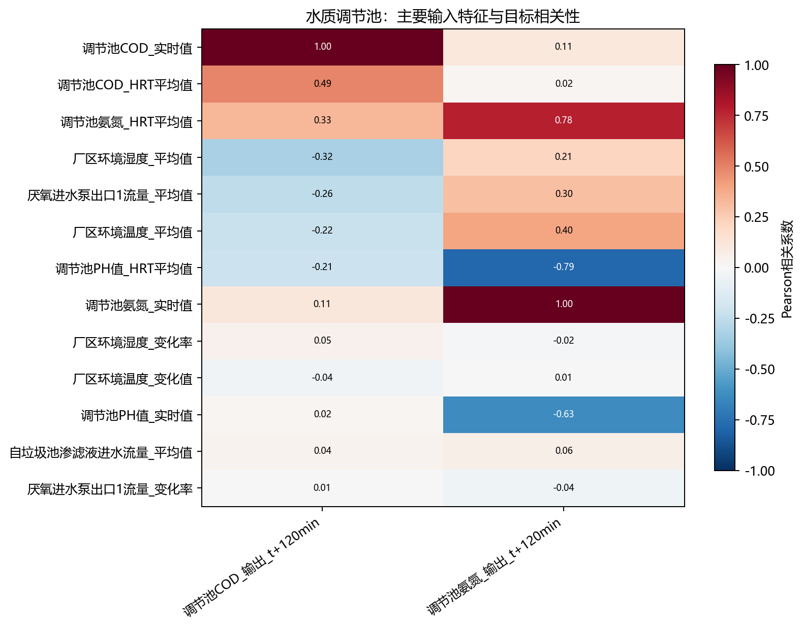
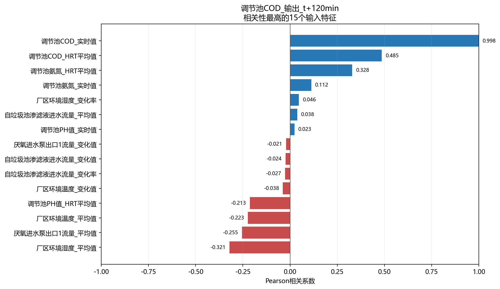
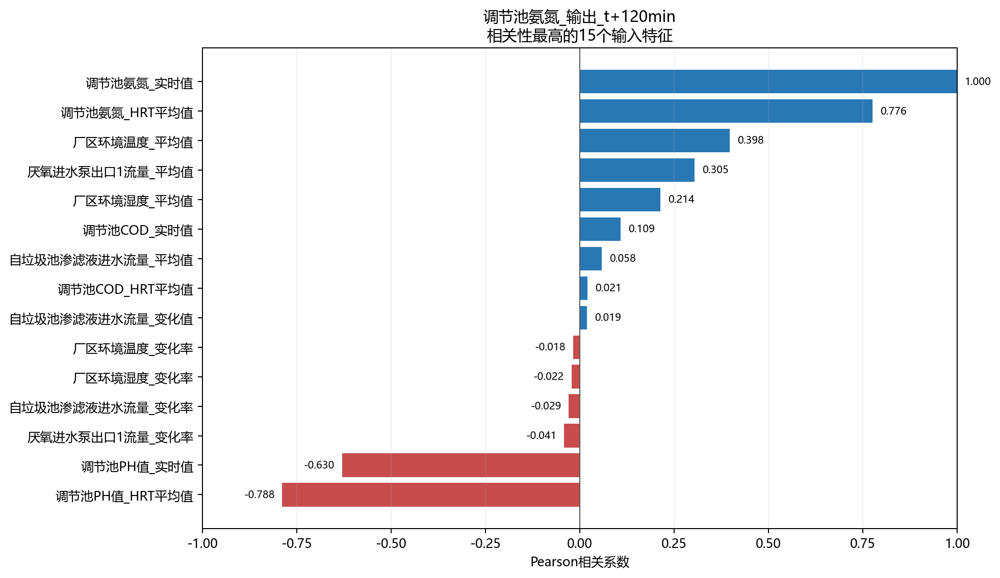

# 水质调节池相关性分析

- 样本数：1,103
- 输入特征数：18
- 目标数：2
- 方法：Pearson衡量线性关系，Spearman衡量单调关系。

## 目标：调节池COD_输出_t+120min

目标均值为3.753e+04，标准差为2863，范围为3.118e+04～4.308e+04，不同取值数为78。

相关性最高的5个输入特征：

- `调节池COD_实时值`：Pearson=0.998，呈强正相关；Spearman=0.998。
- `调节池COD_HRT平均值`：Pearson=0.485，呈中等正相关；Spearman=0.432。
- `调节池氨氮_HRT平均值`：Pearson=0.328，呈弱正相关；Spearman=0.444。
- `厂区环境湿度_平均值`：Pearson=-0.321，呈弱负相关；Spearman=-0.280。
- `厌氧进水泵出口1流量_平均值`：Pearson=-0.255，呈弱负相关；Spearman=-0.254。

## 目标：调节池氨氮_输出_t+120min

目标均值为1544，标准差为282.1，范围为1175～2000，不同取值数为78。

相关性最高的5个输入特征：

- `调节池氨氮_实时值`：Pearson=1.000，呈强正相关；Spearman=0.999。
- `调节池PH值_HRT平均值`：Pearson=-0.788，呈强负相关；Spearman=-0.781。
- `调节池氨氮_HRT平均值`：Pearson=0.776，呈强正相关；Spearman=0.588。
- `调节池PH值_实时值`：Pearson=-0.630，呈中等负相关；Spearman=-0.548。
- `厂区环境温度_平均值`：Pearson=0.398，呈弱正相关；Spearman=0.365。

## 输入特征共线性

- `厂区环境温度_变化值` 与 `厂区环境温度_变化率`：r=0.944。
- `厂区环境湿度_变化值` 与 `厂区环境湿度_变化率`：r=0.940。
- `厂区环境温度_变化值` 与 `厂区环境湿度_变化率`：r=-0.923。
- `厂区环境温度_变化值` 与 `厂区环境湿度_变化值`：r=-0.863。
- `厂区环境温度_变化率` 与 `厂区环境湿度_变化值`：r=-0.863。
- `厂区环境温度_变化率` 与 `厂区环境湿度_变化率`：r=-0.860。
- `调节池PH值_实时值` 与 `调节池PH值_HRT平均值`：r=0.796。
- `调节池PH值_HRT平均值` 与 `调节池氨氮_实时值`：r=-0.787。

## 解读说明

- 相关性不代表因果关系，也不能替代模型特征重要性或消融实验。
- 水质化验值按日复制至分钟级，因此同日内不发生变化，相关性主要反映跨日趋势。
- HRT平均值和对应实时值可能高度相关，建模时应结合共线性结果进行筛选或正则化。