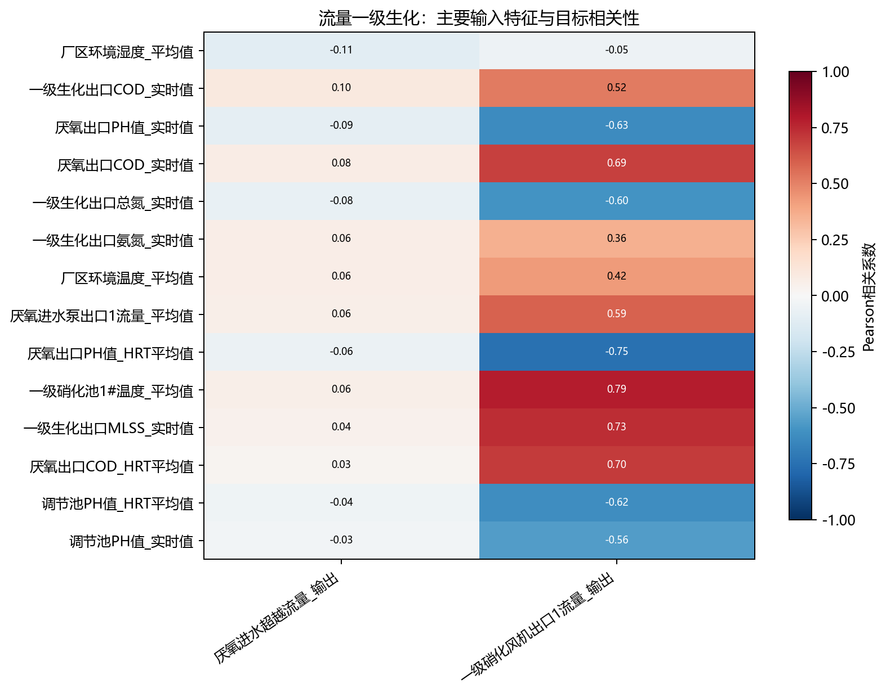
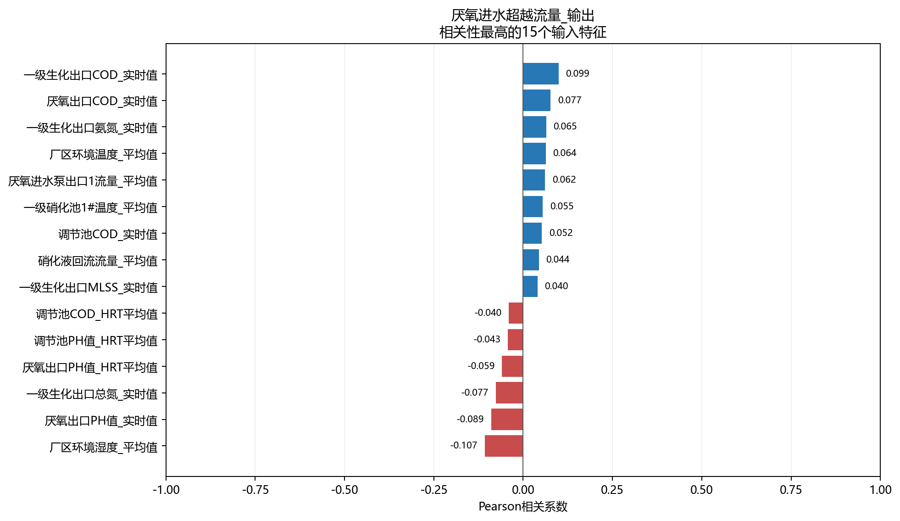
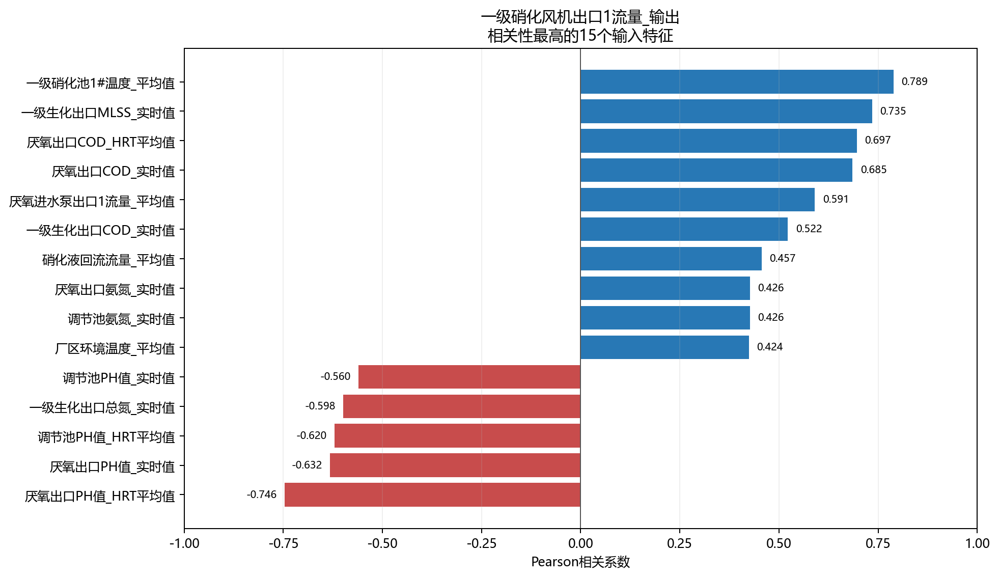

# 流量一级生化相关性分析

- 样本数：132,479
- 输入特征数：36
- 目标数：2
- 方法：Pearson衡量线性关系，Spearman衡量单调关系。

## 目标：厌氧进水超越流量_输出

目标均值为0.008591，标准差为0.07847，范围为0～2.845，不同取值数为5223。

相关性最高的5个输入特征：

- `厂区环境湿度_平均值`：Pearson=-0.107，呈很弱负相关；Spearman=-0.215。
- `一级生化出口COD_实时值`：Pearson=0.099，呈很弱正相关；Spearman=0.036。
- `厌氧出口PH值_实时值`：Pearson=-0.089，呈很弱负相关；Spearman=-0.132。
- `厌氧出口COD_实时值`：Pearson=0.077，呈很弱正相关；Spearman=0.108。
- `一级生化出口总氮_实时值`：Pearson=-0.077，呈很弱负相关；Spearman=-0.029。

## 目标：一级硝化风机出口1流量_输出

目标均值为2381，标准差为685，范围为-24.2～3819，不同取值数为8580。

相关性最高的5个输入特征：

- `一级硝化池1#温度_平均值`：Pearson=0.789，呈强正相关；Spearman=0.733。
- `厌氧出口PH值_HRT平均值`：Pearson=-0.746，呈强负相关；Spearman=-0.816。
- `一级生化出口MLSS_实时值`：Pearson=0.735，呈强正相关；Spearman=0.794。
- `厌氧出口COD_HRT平均值`：Pearson=0.697，呈中等正相关；Spearman=0.736。
- `厌氧出口COD_实时值`：Pearson=0.685，呈中等正相关；Spearman=0.776。

## 输入特征共线性

- `调节池氨氮_实时值` 与 `厌氧出口氨氮_实时值`：r=1.000。
- `调节池氨氮_HRT平均值` 与 `厌氧出口氨氮_HRT平均值`：r=1.000。
- `调节池PH值_HRT平均值` 与 `厌氧出口PH值_HRT平均值`：r=0.926。
- `厌氧出口PH值_HRT平均值` 与 `厌氧出口COD_HRT平均值`：r=-0.914。
- `厌氧出口PH值_HRT平均值` 与 `厌氧出口COD_实时值`：r=-0.904。
- `厌氧出口COD_实时值` 与 `厌氧出口COD_HRT平均值`：r=0.869。
- `调节池PH值_HRT平均值` 与 `厌氧出口COD_实时值`：r=-0.865。
- `调节池PH值_HRT平均值` 与 `厌氧出口COD_HRT平均值`：r=-0.856。

## 解读说明

- 相关性不代表因果关系，也不能替代模型特征重要性或消融实验。
- 水质化验值按日复制至分钟级，因此同日内不发生变化，相关性主要反映跨日趋势。
- HRT平均值和对应实时值可能高度相关，建模时应结合共线性结果进行筛选或正则化。