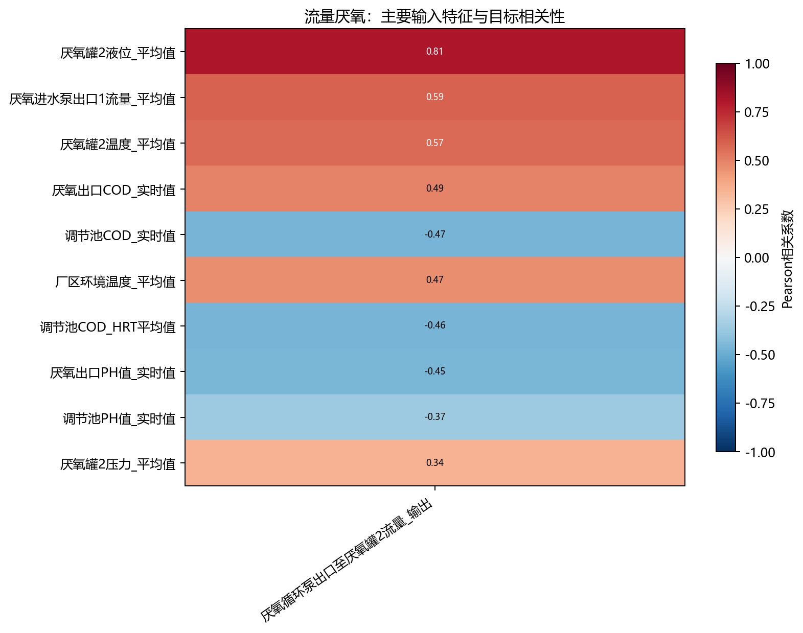
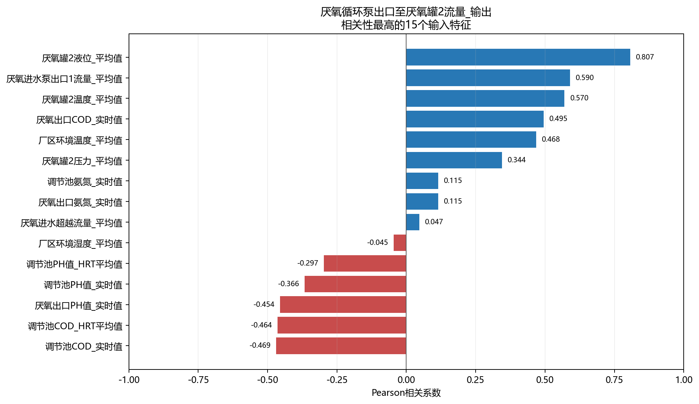

# 流量厌氧相关性分析

- 样本数：132,479
- 输入特征数：30
- 目标数：1
- 方法：Pearson衡量线性关系，Spearman衡量单调关系。

## 目标：厌氧循环泵出口至厌氧罐2流量_输出

目标均值为101.3，标准差为36.9，范围为0～131.7，不同取值数为35795。

相关性最高的5个输入特征：

- `厌氧罐2液位_平均值`：Pearson=0.807，呈强正相关；Spearman=0.664。
- `厌氧进水泵出口1流量_平均值`：Pearson=0.590，呈中等正相关；Spearman=0.369。
- `厌氧罐2温度_平均值`：Pearson=0.570，呈中等正相关；Spearman=-0.212。
- `厌氧出口COD_实时值`：Pearson=0.495，呈中等正相关；Spearman=0.797。
- `调节池COD_实时值`：Pearson=-0.469，呈中等负相关；Spearman=0.054。

## 输入特征共线性

- `调节池氨氮_实时值` 与 `厌氧出口氨氮_实时值`：r=1.000。
- `调节池PH值_HRT平均值` 与 `厌氧出口COD_实时值`：r=-0.865。
- `厌氧出口PH值_实时值` 与 `厌氧出口COD_实时值`：r=-0.856。
- `调节池PH值_HRT平均值` 与 `厌氧出口PH值_实时值`：r=0.809。
- `调节池PH值_实时值` 与 `调节池PH值_HRT平均值`：r=0.797。
- `调节池PH值_HRT平均值` 与 `调节池氨氮_实时值`：r=-0.787。
- `调节池PH值_HRT平均值` 与 `厌氧出口氨氮_实时值`：r=-0.787。
- `调节池氨氮_HRT平均值` 与 `厌氧出口氨氮_实时值`：r=0.781。

## 解读说明

- 相关性不代表因果关系，也不能替代模型特征重要性或消融实验。
- 水质化验值按日复制至分钟级，因此同日内不发生变化，相关性主要反映跨日趋势。
- HRT平均值和对应实时值可能高度相关，建模时应结合共线性结果进行筛选或正则化。